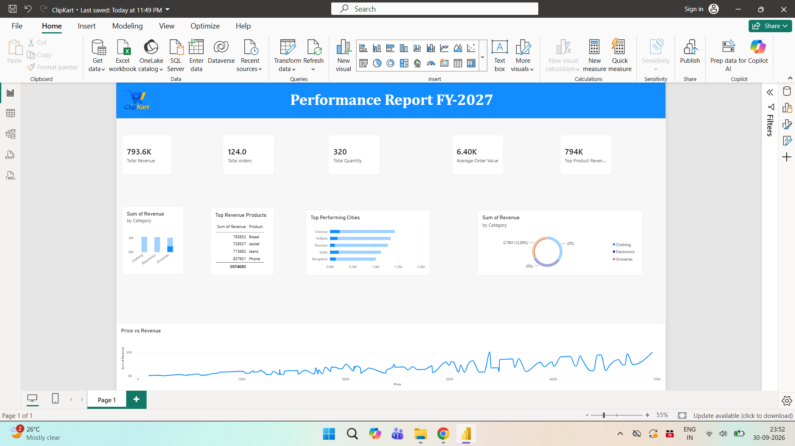

# Dashboard for ClipKart Sales Data

## Project Overview

An interactive Power BI dashboard developed to analyze ClipKart sales data and understand revenue, product performance, and sales trends.

## Tools & Technologies

- Power BI
- DAX
- Data Visualization
- Data Analysis

## Key Analysis

The dashboard provides insights into:

- Total Revenue
- Sales Performance
- Product Performance
- Top Revenue-Generating Products
- Sales Trends
- Customer/Sales Category Analysis

## DAX Functions Used

- SUM
- CALCULATE
- MAXX
- VALUES

## Dashboard Preview

## Project Objective

The objective of this project was to transform raw sales data into an interactive dashboard that can help users understand important sales and revenue metrics and identify high-performing products.

## Skills Demonstrated

Power BI dashboard development, DAX calculations, data analysis, KPI creation, data visualization, and business-oriented reporting.
